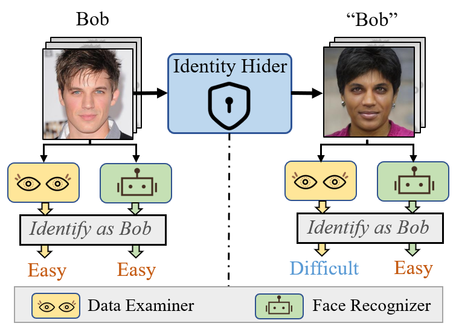

This repo is the official implementation of 
“Seeing is not Believing: An Identity Hider for Human Vision Privacy Protection”  (2024 TBIOM)
Tao Wang, Yushu Zhang*, Zixuan Yang, Xiangli Xiao, Hua Zhang, Zhongyun Hua

预训练模型：
链接：https://pan.baidu.com/s/1I0NHFjM21c1h4YMaMZi--A?pwd=uxgi 
提取码：uxgi



## License

代码参考https://github.com/richarduuz/Research_Project/tree/master/ModelC

https://github.com/zllrunning/face-parsing.PyTorch

https://github.com/justinpinkney/awesome-pretrained-stylegan2

引用
```
@ARTICLE{10646362,
  author={Wang, Tao and Zhang, Yushu and Yang, Zixuan and Xiao, Xiangli and Zhang, Hua and Hua, Zhongyun},
  journal={IEEE Trans. Biometrics Behav. Identity Sci.}, 
  title={Seeing is not Believing: An Identity Hider for Human Vision Privacy Protection}, 
  year={2024},
  volume={},
  number={},
  pages={1-1},
  doi={10.1109/TBIOM.2024.3449849}}

```
