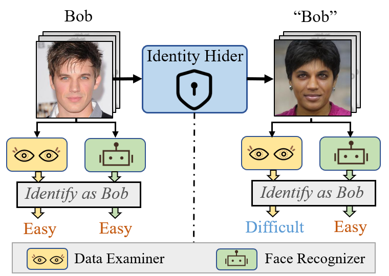

This repo is the official implementation of 
“Seeing is not Believing: An Identity Hider for Human Vision Privacy Protection”  (2025 TBIOM)
Tao Wang, Yushu Zhang*, Zixuan Yang, Xiangli Xiao, Hua Zhang, Zhongyun Hua

预训练模型：百度网盘
链接: https://pan.baidu.com/s/1lrSQTJPm2uOBwBSeq8Hp3A?pwd=cncs 提取码: cncs 复制这段内容后打开百度网盘手机App，操作更方便哦



## License

代码参考https://github.com/richarduuz/Research_Project/tree/master/ModelC

https://github.com/zllrunning/face-parsing.PyTorch

https://github.com/justinpinkney/awesome-pretrained-stylegan2

引用
```
@ARTICLE{10646362,
  author={Wang, Tao and Zhang, Yushu and Yang, Zixuan and Xiao, Xiangli and Zhang, Hua and Hua, Zhongyun},
  journal={IEEE Transactions on Biometrics, Behavior, and Identity Science}, 
  title={Seeing is Not Believing: An Identity Hider for Human Vision Privacy Protection}, 
  year={2025},
  volume={7},
  number={2},
  pages={170-181},
  keywords={Face recognition;Visualization;Protection;Privacy;Security;Machine vision;Generative adversarial networks;Face privacy;hider;human vision;identifiability;AI-generated content},
  doi={10.1109/TBIOM.2024.3449849}}

```
